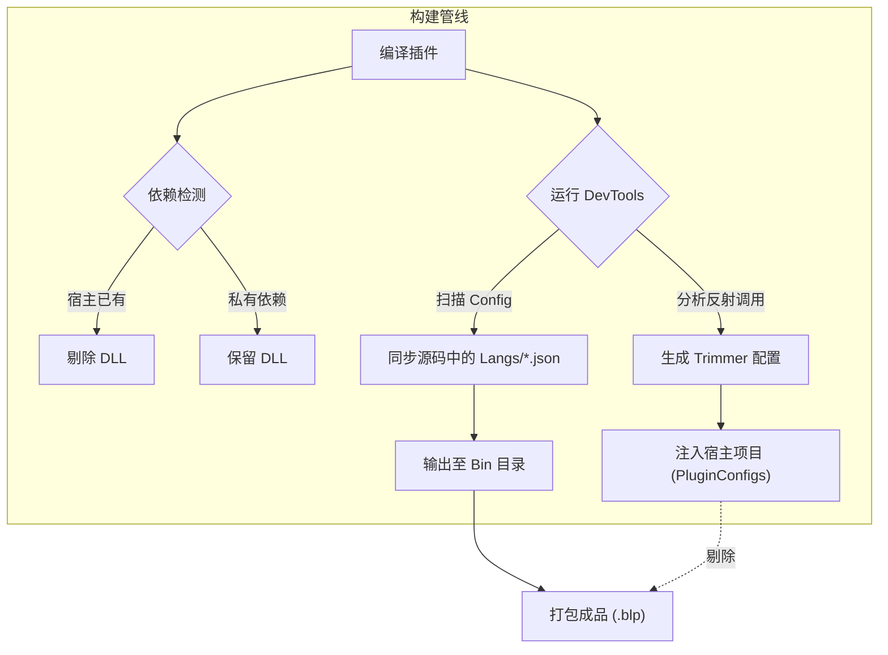

import { Card, CardGrid } from '@astrojs/starlight/components';

:::caution[预览版文档]
本文档适用于 **BetterLyrics** 的预览版本。文中涉及的 API、构建工具链及开发工作流尚处于 **极度不稳定** 状态，随时可能发生不兼容的变更（Breaking Changes），且不另行通知。请务必谨慎尝鲜。
:::

欢迎加入 BetterLyrics 开发社区！本指南将助你快速上手插件开发。

我们提供了一套高度自动化的构建体系，秉持 **“代码优先”（Code-First）** 的理念——代码即单一事实来源 (Single Source of Truth)。我们将那些 **繁琐的工作** 交由工具自动处理：从自动规避依赖冲突 (DLL Hell) 到解决 Native AOT 裁剪难题，再到多语言资源的自动生成，一切无需开发者手动处理。

## 构建流程概述

为了保障插件在 Native AOT 环境下的极致性能与稳定性，我们定制了一套 MSBuild 构建管线：

### 智能依赖剔除╻Smart Exclusion

构建脚本会自动比对宿主程序（Host App）已有的依赖库（如 `BetterLyrics.Core` 或系统库）。一旦发现重复，会自动从输出中 **剔除** 冗余 DLL，既减小体积又根治版本冲突。

### 源码驱动的本地化╻Source-First

`DevTools` 会直接扫描你的 `Config` 定义类，并在源码目录中自动生成或同步 JSON 语言文件，让多语言支持变得“零成本”。

### 自动防裁剪注入╻Anti-Trim

工具会自动分析代码中的反射（Reflection）调用，生成 `TrimmerRoots.xml` 和 `Config` 代码并 **注入** 到宿主项目的 `PluginConfigs` 目录。这确保了你的插件代码在 AOT 激进裁剪模式下依然“存活”，且不会污染最终的插件包。

## 构建流程图

